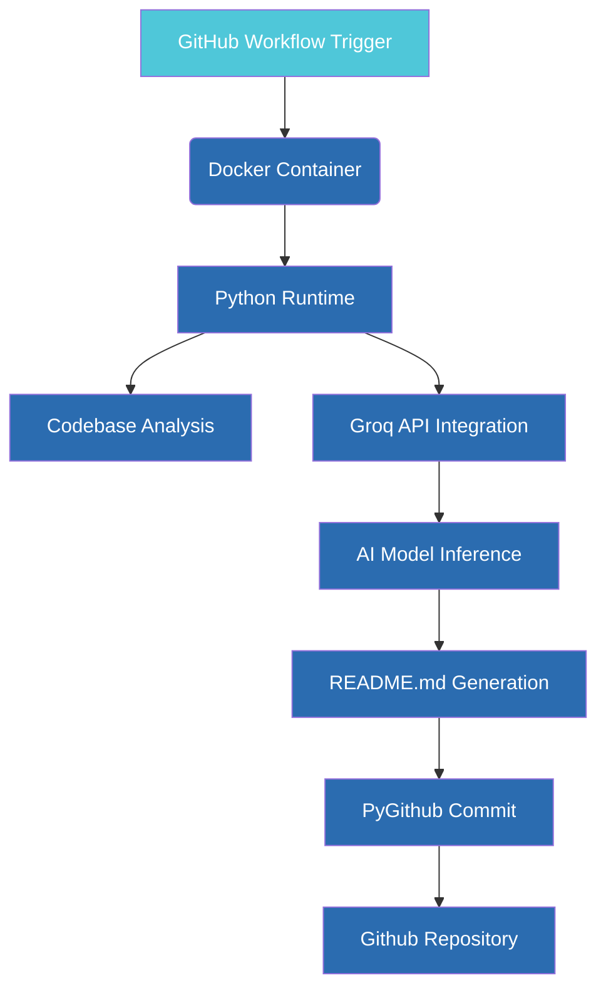

<think>
Okay, let's start by understanding the user's request. They want me to generate a README.md for their repository based on the provided files. The README should follow a specific structure with sections like Project Overview, Tech Stack, Architecture, Installation & Usage, Contributing, and License. 

First, I need to analyze the repository content. The main files are the GitHub workflow, action.yml, Dockerfile, and requirements.txt. The project seems to be a GitHub Action called GitScribe AI that generates a README.md using the Groq API. 

For the Project Overview, I should explain what GitScribe does. It's an action that automatically creates a professional README by scanning the repo and using an AI model from Groq. The reason it exists is to automate documentation, saving time for developers.

Next, the Tech Stack. Looking at the files, the Dockerfile uses Python 3.12, so Python is part of the stack. The action uses Groq's API, PyGithub for GitHub interactions, Docker for containerization, and GitHub Actions for CI/CD. Each of these needs a brief description of their role.

The Architecture section requires a Mermaid.js flowchart. The main components are the GitHub Workflow triggering the action, the Docker container running the Python script, which uses Groq and PyGithub. The flow should show how the workflow starts, runs the container, processes the code, and commits the README.

Installation & Usage instructions need to guide users on setting up the action. They need to add the workflow file, set the GROQ_API_KEY secret, and possibly configure other parameters like the model. Steps should be clear, including where to place files and how to set secrets.

Contributing should be straightforward, mentioning forking, branching, testing, and submitting PRs. The License is MIT, so I'll include a placeholder line for that.

I need to make sure the Mermaid diagram accurately reflects the components: GitHub Workflow triggers the Docker container, which uses Python, Groq, and PyGithub to generate the README and commit it back.

I should check for any badges or icons. The GitHub Marketplace badge is appropriate here. Also, using icons in the Mermaid diagram for clarity.

Finally, ensure the tone is professional yet approachable, avoiding markdown code fences and using proper GitHub-flavored Markdown. Verify that all sections are covered and the information is accurate based on the provided files.
</think>

# GitScribe AI [](https://github.com/marketplace/actions/gitscribe-ai)

**Automate professional README.md generation using Groq AI models**

---

## 📦 Project Overview

GitScribe AI is a GitHub Action that automatically analyzes your repository's codebase and generates a human-readable, professional README.md using the Groq API (powered by Qwen models). This action helps maintain up-to-date documentation by:

- Scanning code files and architecture
- Generating structured documentation
- Committing the README directly to your repo
- Supporting multiple AI models for quality/speed tradeoffs

Ideal for teams wanting to automate documentation while maintaining technical accuracy and readability.

---

## ⚙️ Tech Stack

| Technology       | Role                                                                 |
|------------------|----------------------------------------------------------------------|
| **Python 3.12**  | Core runtime environment                                             |
| **Groq API**     | AI model inference (Qwen3-32B for quality, Qwen2.5-32B for speed)  |
| **PyGithub**     | GitHub API integration for repository operations                   |
| **Docker**       | Containerized action for consistent execution                      |
| **GitHub Actions**| CI/CD workflow automation for triggering documentation updates   |

---

## 🧠 Architecture



---

## 🚀 Installation & Usage

### 1. Prerequisites
- GitHub repository with write permissions
- [Groq API key](https://console.groq.com) (free tier available)

### 2. Setup Steps

1. **Add workflow file**  
   Create `.github/workflows/gitscribe.yml` with the provided workflow configuration

2. **Set secrets**  
   In your repository settings → Secrets → Actions:
   ```bash
   GROQ_API_KEY=your_api_key_here
   ```

3. **Optional configuration**  
   Customize these parameters in your workflow:
   ```yaml
   model: "qwen/qwen2.5-coder-32b-instruct" # For faster generation
   branch: "docs" # Target branch for README
   ```

4. **Trigger workflow**  
   Push changes to `main` or run manually from the Actions tab

---

## 🤝 Contributing

1. Fork the repository
2. Create a feature branch: `git checkout -b feature/your-feature`
3. Test locally using `act` (GitHub Actions CLI)
4. Submit a pull request with clear documentation

All contributions must pass existing tests and follow PEP8 guidelines.

---

## 📄 License

MIT License © 2024 GitScribe AI  
See [LICENSE](LICENSE) for full details.