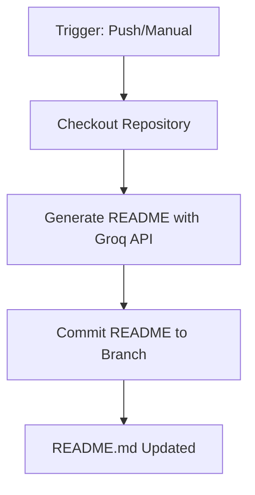

# GitScribe AI

## 📦 Project Overview
GitScribe AI is a GitHub Action that automatically generates professional README.md files using AI-powered documentation. It analyzes repository code and structure to produce human-readable documentation that maintains technical accuracy while following best practices for developer communication. The tool is ideal for developers who want to automate documentation maintenance without sacrificing quality.

The solution uses the Groq API with Qwen large language models to understand codebases and generate context-aware documentation. It supports Python projects out-of-the-box and can be extended to other languages by modifying the code analysis logic. The workflow integrates seamlessly with GitHub's CI/CD pipeline, allowing automatic README updates on code pushes.

## ⚙️ Tech Stack
| Technology      | Version/Detail                | Role                          |
|-----------------|-------------------------------|-------------------------------|
| Python          | 3.12                          | Core runtime environment        |
| Groq API        | qwen/qwen3-32b                | AI-powered documentation engine |
| PyGithub        | 2.3.0+                        | GitHub API integration          |
| Docker          | Custom image (Python base)    | Containerized execution         |
| GitHub Actions  | Workflow dispatch + schedules | Automation orchestration        |

## 🏗️ Architecture


## 🚀 Installation & Usage
1. **Prerequisites**:
   - GitHub repository with write access
   - Groq API key (obtain from https://console.groq.com)

2. **Setup**:
   ```bash
   # Add workflow file to your repository
   mkdir -p .github/workflows
   curl -o .github/workflows/gitscribe.yml https://raw.githubusercontent.com/your-repo/main/.github/workflows/sample-workflow.yml
   ```

3. **Configure Secrets**:
   In your GitHub repository settings → Secrets → Actions, add:
   ```text
   GROQ_API_KEY=your_api_key_here
   ```

4. **Trigger Workflow**:
   - Push changes to `main` branch
   - Or manually run from the Actions tab
   - Or configure a weekly schedule

5. **Verify Output**:
   Check the generated README.md in your repository root after workflow completion

## 🤝 Contributing
- Fork the repository
- Create feature branch: `git checkout -b feature/your-feature`
- Make changes and commit: `git commit -am "Add your feature"`
- Push to your fork: `git push origin feature/your-feature`
- Submit pull request
- For major changes, open an issue for discussion first

## 📄 License
MIT License — see LICENSE for details.