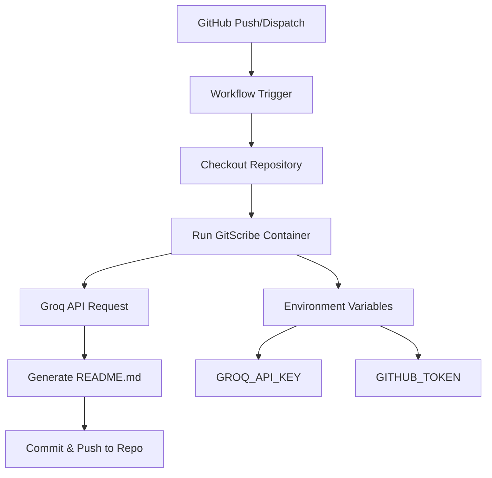

<think>
Okay, let's tackle this. The user wants me to generate a README.md for their repository based on the provided files. First, I need to understand what each file does and how they fit together. 

Looking at the .github/workflows/sample-workflow.yml, it's a GitHub Action workflow that triggers on push to main or master, or manually. It uses the GitScribe AI action to generate a README. The action requires a GROQ_API_KEY. The workflow checks out the repo and runs the action.

Next, the action.yml defines the GitHub Action. It takes inputs like the Groq API key, GitHub token, branch, model, and repo name. It uses a Docker container for the runtime. The outputs include whether the README was committed.

The Dockerfile sets up the environment with Python 3.12, installs dependencies like git, and copies the generate_docs.py script. It also installs the required Python packages from requirements.txt.

The requirements.txt lists groq and PyGithub as dependencies. 

Now, structuring the README as per the instructions. 

Project Overview: The project is an automated README generator using Groq's AI models via the GitScribe AI action. It exists to streamline documentation by generating a professional README from the codebase.

Tech Stack: Need to list each technology. Python is the main language. GitHub Actions for CI/CD, Docker for containerization. Groq API for AI model, PyGithub for GitHub interactions, Git for version control.

Architecture: The Mermaid diagram should show the workflow. Start with the GitHub Action trigger, then checkout code, run GitScribe AI (which uses Groq API), and commit the README back.

Installation & Usage: Steps to set up the workflow. Prerequisites are a Groq API key and GitHub token. Instructions to copy the workflow file, set secrets, and push to trigger.

Contributing: Guide contributors to check issues, fork, develop, test locally, and submit PRs.

License: Placeholder MIT line.

Need to make sure the Mermaid diagram accurately reflects the components: GitHub Action triggering, Docker container running the action, Groq API integration, and the resulting README commit.

Check for any missing tech in the stack. The Dockerfile uses Python, so that's covered. PyGithub is a Python library. The workflow uses actions/checkout.

Ensure the badges and icons are appropriate. Maybe a GitHub Actions badge for the workflow.

Also, verify that all required environment variables are mentioned, like GROQ_API_KEY and GITHUB_TOKEN.

Make sure the installation steps are clear: copying the workflow file, adding secrets, and how the workflow runs.

Double-check that the contributing section is concise but informative, encouraging contributions with steps to follow.

Finally, the license section is a placeholder, so just the MIT line is needed.

Putting it all together in a professional yet approachable tone, using GitHub-flavored Markdown with badges, tables, and Mermaid diagram as specified.
</think>

# GitScribe AI [](https://github.com/your-username/your-repo/actions)

Automatically generate a professional, human-readable README.md for your repository using the power of Groq's Qwen large language models. This GitHub Action scans your codebase and produces documentation that reflects your project's structure and purpose.

---

## Project Overview

GitScribe AI solves the problem of manual README maintenance by:
- Analyzing source code and documentation files
- Generating structured documentation with technical accuracy
- Automatically updating the README.md file in your repository
- Using state-of-the-art AI models for natural language output

The action is designed to run as part of your CI/CD pipeline, ensuring your documentation stays up-to-date with your codebase.

---

## Tech Stack

| Technology       | Role                                                                 |
|------------------|----------------------------------------------------------------------|
| **Python 3.12**  | Primary implementation language                                      |
| **GitHub Actions** | Automation orchestration and workflow execution                   |
| **Groq API**     | AI model inference (Qwen series for code/docs generation)           |
| **Docker**       | Containerized action runtime environment                           |
| **PyGithub**     | GitHub API integration for repository operations                   |
| **Git**          | Version control integration for README commits                    |

---

## Architecture



---

## Installation & Usage

### Prerequisites
1. **Groq API Key** - Get a free key from [Groq Console](https://console.groq.com)
2. **GitHub Token** - Uses built-in `GITHUB_TOKEN` by default

### Setup Steps
1. Copy `.github/workflows/sample-workflow.yml` to `.github/workflows/gitscribe.yml` in your repo
2. Set `GROQ_API_KEY` in your repository secrets
3. Commit the workflow file and push to `main`

### Workflow Configuration
```yaml
on:
  push:
    branches: [main]
  workflow_dispatch:
jobs:
  generate-readme:
    steps:
      - uses: actions/checkout@v4
      - name: Run GitScribe AI
        uses: ./ # or your published action path
        with:
          groq_api_key: ${{ secrets.GROQ_API_KEY }}
          model: "qwen/qwen3-32b" # for high-quality output
```

---

## Contributing

1. Fork the repository
2. Create a feature branch: `git checkout -b feature/your-feature`
3. Write your changes and test locally using Docker
4. Submit a pull request with clear documentation

**Note:** For local testing, set environment variables in a `.env` file:
```env
GROQ_API_KEY=your_key
GITHUB_TOKEN=your_token
```

---

## License

MIT License © 2024 GitScribe AI

> This project uses the Groq API. By using this action, you agree to Groq's [Terms of Service](https://groq.com/terms-of-service).