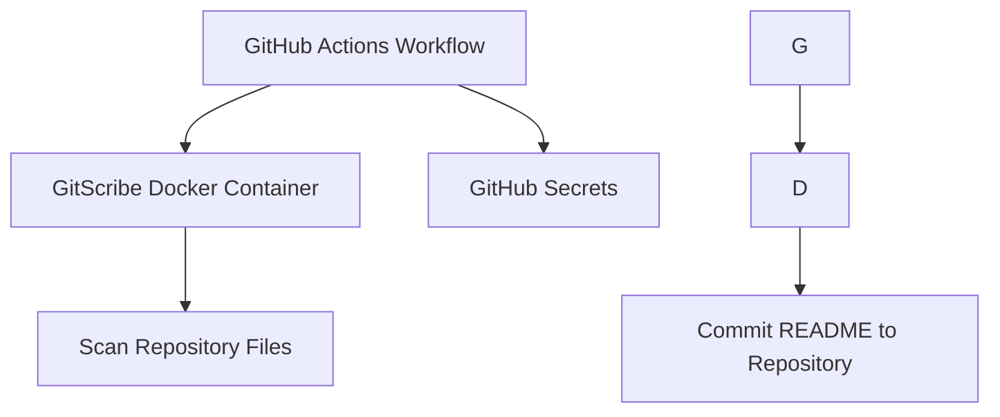

Automatically generate a professional, human-readable README.md for your repository using AI-powered code analysis. This GitHub Action scans your project, understands its structure, and produces documentation that reflects your codebase's purpose and architecture.

---

## Project Overview


The action uses AI to analyze file contents, detect patterns, and produce structured documentation without requiring any special comments or annotations in your code.

---

## Tech Stack

| Technology | Role |
|------------|------|
| **Python 3.12** | Runtime environment for the action logic |
| **Docker** | Containerization for consistent execution |
| **GitHub Actions** | Automation workflow orchestration |
| **PyGithub** | GitHub API integration for repository operations |
| **Git** | Version control integration for documentation commits |

---

## Architecture



---

## Installation & Usage

1. **Create a GitHub Personal Access Token**  
   - Generate a token with `repo` scope [here](https://github.com/settings/tokens)

2. **Add Required Secrets**  
   Add these to your repository's Secrets settings:
   ```bash
   ```

3. **Create Workflow File**  
   Copy `.github/workflows/sample-workflow.yml` to your repository as `.github/workflows/gitscribe.yml`

4. **Configure Workflow**  
   Optional parameters in the workflow file:
   ```yaml
   branch: main # target branch for documentation commit
   ```

5. **Trigger Workflow**  
   Push changes to `main` or manually run the action from the **Actions** tab.

Resulting README will be committed with a message like:  

---

## Contributing

1. Fork the repository
2. Create a feature branch: `git checkout -b feature/your-feature`
3. Make your changes and test locally
4. Submit a pull request with clear documentation of your changes

All contributions are welcome! For major changes, please open an issue first to discuss what you'd like to implement.

---

## License