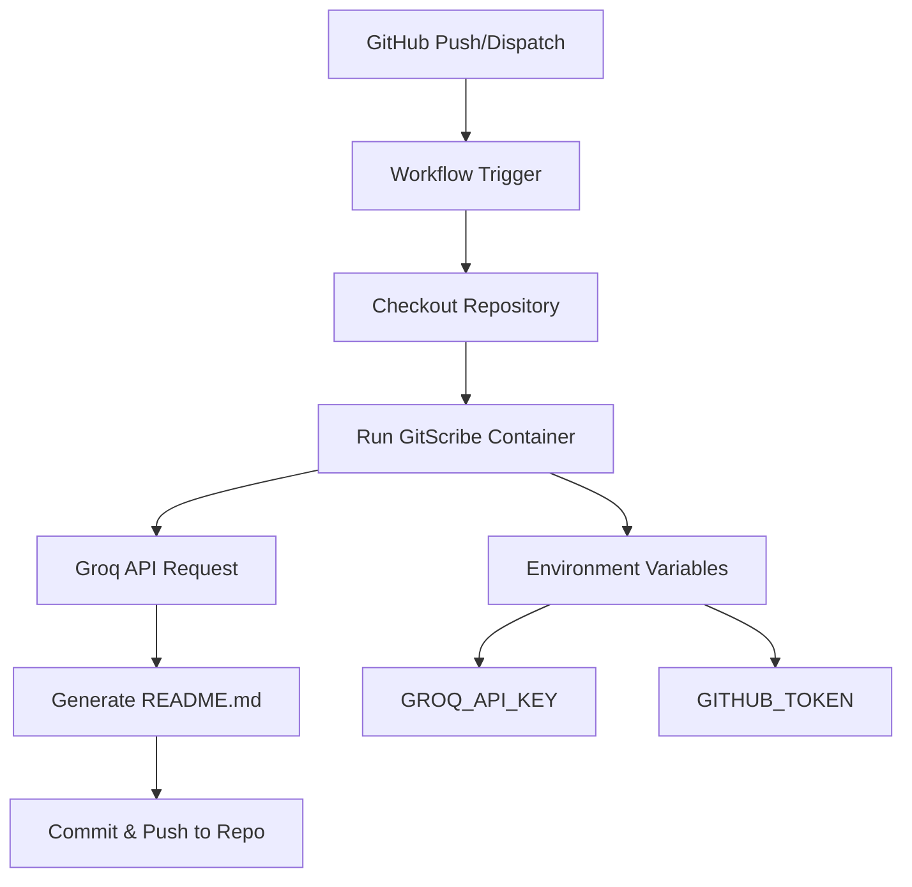

# GitScribe AI [](https://github.com/your-username/your-repo/actions)

Automatically generate a professional, human-readable README.md for your repository using the power of Groq's Qwen large language models. This GitHub Action scans your codebase and produces documentation that reflects your project's structure and purpose.

---

## Project Overview

GitScribe AI solves the problem of manual README maintenance by:
- Analyzing source code and documentation files
- Generating structured documentation with technical accuracy
- Automatically updating the README.md file in your repository
- Using state-of-the-art AI models for natural language output

The action is designed to run as part of your CI/CD pipeline, ensuring your documentation stays up-to-date with your codebase.

---

## Tech Stack

| Technology       | Role                                                                 |
|------------------|----------------------------------------------------------------------|
| **Python 3.12**  | Primary implementation language                                      |
| **GitHub Actions** | Automation orchestration and workflow execution                   |
| **Groq API**     | AI model inference (Qwen series for code/docs generation)           |
| **Docker**       | Containerized action runtime environment                           |
| **PyGithub**     | GitHub API integration for repository operations                   |
| **Git**          | Version control integration for README commits                    |

---

## Architecture



---

## Installation & Usage

### Prerequisites
1. **Groq API Key** - Get a free key from [Groq Console](https://console.groq.com)
2. **GitHub Token** - Uses built-in `GITHUB_TOKEN` by default

### Setup Steps
1. Copy `.github/workflows/sample-workflow.yml` to `.github/workflows/gitscribe.yml` in your repo
2. Set `GROQ_API_KEY` in your repository secrets
3. Commit the workflow file and push to `main`

### Workflow Configuration
```yaml
on:
  push:
    branches: [main]
  workflow_dispatch:
jobs:
  generate-readme:
    steps:
      - uses: actions/checkout@v4
      - name: Run GitScribe AI
        uses: ./ # or your published action path
        with:
          groq_api_key: ${{ secrets.GROQ_API_KEY }}
          model: "qwen/qwen3-32b" # for high-quality output
```

---

## Contributing

1. Fork the repository
2. Create a feature branch: `git checkout -b feature/your-feature`
3. Write your changes and test locally using Docker
4. Submit a pull request with clear documentation

**Note:** For local testing, set environment variables in a `.env` file:
```env
GROQ_API_KEY=your_key
GITHUB_TOKEN=your_token
```

---

## License

MIT License © 2024 GitScribe AI

> This project uses the Groq API. By using this action, you agree to Groq's [Terms of Service](https://groq.com/terms-of-service).
