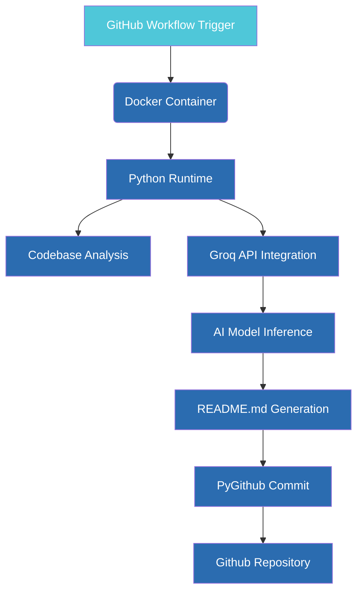

# GitScribe AI [](https://github.com/marketplace/actions/gitscribe-ai)

**Automate professional README.md generation using Groq AI models**

---

## 📦 Project Overview

GitScribe AI is a GitHub Action that automatically analyzes your repository's codebase and generates a human-readable, professional README.md using the Groq API (powered by Qwen models). This action helps maintain up-to-date documentation by:

- Scanning code files and architecture
- Generating structured documentation
- Committing the README directly to your repo
- Supporting multiple AI models for quality/speed tradeoffs

Ideal for teams wanting to automate documentation while maintaining technical accuracy and readability.

---

## ⚙️ Tech Stack

| Technology       | Role                                                                 |
|------------------|----------------------------------------------------------------------|
| **Python 3.12**  | Core runtime environment                                             |
| **Groq API**     | AI model inference (Qwen3-32B for quality, Qwen2.5-32B for speed)  |
| **PyGithub**     | GitHub API integration for repository operations                   |
| **Docker**       | Containerized action for consistent execution                      |
| **GitHub Actions**| CI/CD workflow automation for triggering documentation updates   |

---

## 🧠 Architecture



---

## 🚀 Installation & Usage

### 1. Prerequisites
- GitHub repository with write permissions
- [Groq API key](https://console.groq.com) (free tier available)

### 2. Setup Steps

1. **Add workflow file**  
   Create `.github/workflows/gitscribe.yml` with the provided workflow configuration

2. **Set secrets**  
   In your repository settings → Secrets → Actions:
   ```bash
   GROQ_API_KEY=your_api_key_here
   ```

3. **Optional configuration**  
   Customize these parameters in your workflow:
   ```yaml
   model: "qwen/qwen2.5-coder-32b-instruct" # For faster generation
   branch: "docs" # Target branch for README
   ```

4. **Trigger workflow**  
   Push changes to `main` or run manually from the Actions tab

---

## 🤝 Contributing

1. Fork the repository
2. Create a feature branch: `git checkout -b feature/your-feature`
3. Test locally using `act` (GitHub Actions CLI)
4. Submit a pull request with clear documentation

All contributions must pass existing tests and follow PEP8 guidelines.

---

## 📄 License

MIT License © 2024 GitScribe AI  
See [LICENSE](LICENSE) for full details.
